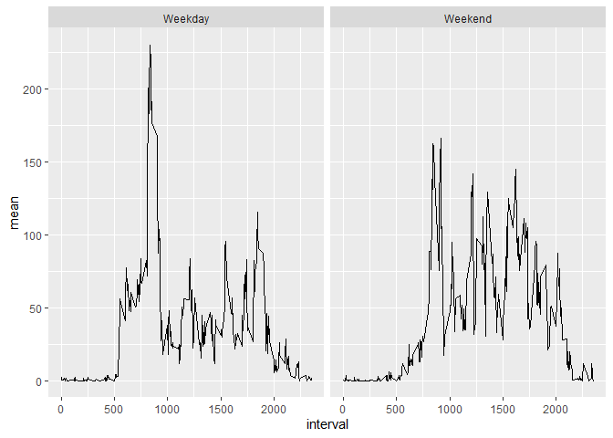

## Introduction

In the following report, I run a quick exploratory analysis of the fitness data.
I will be using the Tidyverse package for plotting and manipulating the data.


```r
library(tidyverse)
t1<-read.csv("activity.csv")
```

## Part 1: Mean, Median, Histogram 


```r
sum(t1$steps, na.rm = T)
```

```
## [1] 570608
```

```r
smry<-tapply(t1$steps, t1$date, sum, na.rm=TRUE)
mean(smry, na.rm=TRUE)
```

```
## [1] 9354.23
```

```r
median(smry, na.rm=TRUE)
```

```
## [1] 10395
```

```r
smrytbl<-as.data.frame(smry)
smrytbl %>% ggplot(aes(smry)) + geom_histogram(bins=20)
```

<!-- -->

Excluding the NA values:

- the total number of steps is 570608. 
- the  mean number of steps per day is 9354.2295082. 
- the median number of steps per day is 10395

## Part 2: Time Series For Average Interval


```r
tsplot<-t1 %>% group_by(interval) %>% summarise(mean=mean(steps,na.rm = T)) 
tsplot %>% ggplot(aes(interval, mean))+geom_line()
```

<!-- -->

```r
tsplot$interval[which.max(tsplot$mean)]
```

```
## [1] 835
```

The time series plot shows a clear spike after 800, and the busiest interval is 835, 
with around 206 steps.

## Part 3: Replacing NA Values

To replace NA values, I merged the table containing average values per interval with the original table, and replaced all NA values with the corresponding interval average.


```r
sum(is.na(t1$steps))
```

```
## [1] 2304
```

```r
t2<-(merge(tsplot, t1))
t2<-t2[order(t2$date), ]
t2$steps[is.na(t2$steps)]<-t2$mean[is.na(t2$steps)]

smry2<-tapply(t2$steps, t2$date, sum)
mean(smry2)
```

```
## [1] 10766.19
```

```r
median(smry2)
```

```
## [1] 10766.19
```

```r
smrytbl2<-as.data.frame(smry2)
smrytbl2 %>% ggplot(aes(smry2)) + geom_histogram(bins=20)
```

<!-- -->

There are 2304 NA values.

After replacing the NA values:

- the total number of steps is 656738. 
- the  mean number of steps per day is about 10766. 
- the median number of steps per day is 10766.1886792.


## Part 4: Weekday vs Weekend

In this part, I create a factor variable for the weekdays and weekends, and then use ggplot2 to create panel plots, faceting on the factor variable.


```r
t3<-t2
t3$date<-as.Date(t3$date)
t3$weekdays<-weekdays(t3$date)
t3$ends<-factor(t3$weekdays)
levels(t3$ends)<-c("Weekday", "Weekday", "Weekend", "Weekend", "Weekday", "Weekday", "Weekday")

t3plot<-t3 %>% group_by(interval, ends)%>%summarise(mean=mean(steps))
t3plot %>% ggplot(aes(interval, mean))+geom_line()+facet_wrap(~ends)
```

<!-- -->
